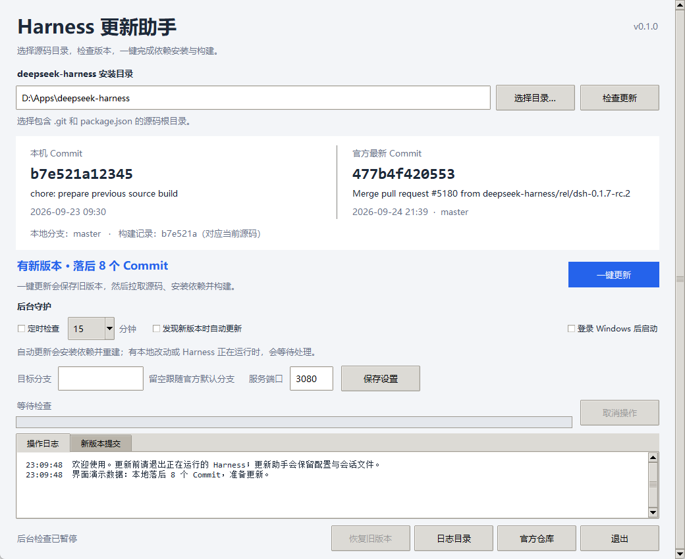
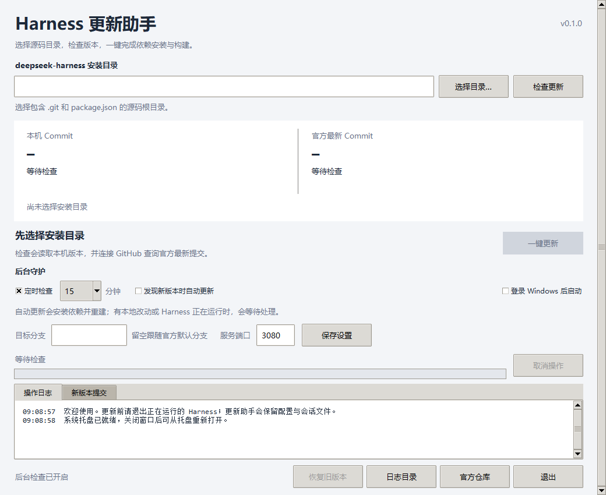

<div align="center">

<h1>Harness 更新助手</h1>

<p><strong>看清本机与官方的 Commit，再放心更新 DeepSeek Harness。</strong></p>

<p>为通过 Git 安装的 <a href="https://github.com/deepseek-ai/deepseek-harness">DeepSeek Harness</a> 提供中文桌面界面、后台检查、可选自动更新和失败恢复。</p>

<p>
  <a href="https://github.com/snake-aabb-wtf/deepseek-harness-updater/actions/workflows/ci.yml"></a>
  <a href="https://github.com/snake-aabb-wtf/deepseek-harness-updater/releases/latest"></a>
  <a href="LICENSE"></a>
  
  
</p>

<p><strong><a href="https://github.com/snake-aabb-wtf/deepseek-harness-updater/releases/latest">下载 Windows 版</a></strong> · <a href="#三步开始">三步开始</a> · <a href="#从-python-源码运行">运行方式</a> · <a href="#哪些安装方式可以识别">适用范围</a></p>

</div>

> [!NOTE]
> 本项目是独立的社区更新辅助工具，并非 DeepSeek 官方发行包。更新对象是 **保留 `.git` 的 Harness 源码安装**；运行更新助手不需要另装 Python，更新 Harness 本身仍需要 Git 和符合目标版本要求的 Node.js。

## 界面预览

<p align="center">
  
</p>

<p align="center"><sub>Windows 上真实运行的 Tk 界面；此图的目录和 Commit 为演示数据。</sub></p>

<details>
<summary>查看打包后的 EXE 首次启动画面（实机截图）</summary>

<br>



</details>

| 看得到 | 做得到 | 守得住 |
| :--- | :--- | :--- |
| 并排显示本机 HEAD、官方最新 Commit、落后数量和构建记录 | 一键快进 Git 源码，按目标版本安装依赖并构建 | 本地改动、分叉历史或 Harness 运行中会暂停，不强制覆盖 |
| 展示新增提交和实时操作日志 | 定时检查、可选自动更新、系统托盘与 Windows 登录启动 | 保存旧 Commit；构建失败时尝试恢复，意外中断后提示继续处理 |

## 三步开始

1. 从 [最新 Release](https://github.com/snake-aabb-wtf/deepseek-harness-updater/releases/latest) 下载 `HarnessUpdater-*-Windows-x64.zip`，解压后双击 `HarnessUpdater.exe`。也可以直接下载同一页的 EXE；`SHA256SUMS.txt` 可用来校验下载文件。首次打开无需管理员权限。
2. 点击 **选择目录**，选中 `git clone` 得到的 `deepseek-harness` **根目录**，其中应有 `package.json` 和 `.git`。点击 **检查更新**，阅读本机与官方 Commit、构建状态和检查提示。
3. 退出正在运行的 Harness，点击 **一键更新**；如果源码已是最新但还未构建，按钮会显示 **安装依赖并构建**。等日志显示完成，再按原有方式启动 Harness，例如在源码目录执行 `pnpm dsh web`。

默认每 15 分钟检查一次，**不会默认自动修改源码**。只有勾选 **发现新版本时自动更新** 才会自动安装和构建。关闭窗口会进入系统托盘；托盘不可用时会最小化到任务栏。彻底退出请用界面或托盘里的 **退出**。

> [!TIP]
> 不要选择用户数据目录 `.dsh`、`apps/cli` 或 `node_modules`。如果检查结果指出本地改动、版本分叉或进程占用，请按提示处理后再重试；更新助手不会替你删除文件或覆盖改动。

**发现新版本时自动更新** 默认关闭，勾选后才会自动修改源码、安装依赖和重建。自动更新与手动更新使用相同的检查和恢复流程。Harness 正在运行、有本地改动，或者分支不适合快进时，会暂停更新，等待条件满足。一次更新失败后，GUI 会关闭自动更新；无窗口守护模式也不会反复尝试同一个已失败 Commit。

Windows 可勾选 **登录 Windows 后启动**，无需管理员权限。该开关使用当前用户的启动项，取消勾选即可移除。若移动了 EXE 或源码位置，请关闭后重新开启这个选项。

窗口较小时可用右侧滚动条查看底部日志和按钮。`新版本提交` 标签页显示最多 12 条新增提交。

## 从 Python 源码运行

需要完整安装的 Python 3.10 或更新版本，并包含 Tkinter。Windows 官方 Python 安装程序默认提供 Tcl/Tk；Linux 一般需要额外安装系统的 `python3-tk` 包。

在本项目目录执行：

```powershell
python -m pip install -r requirements.txt
python main.py
```

Windows 也可双击 `启动更新助手.pyw`，通过 Python 的窗口模式打开，不显示控制台。

更新 Harness 需要 Git，以及满足**目标版本** `package.json -> engines.node` 要求的 Node.js。程序会自动下载该版本固定的 pnpm，放入更新助手的工具缓存；无需修改全局 pnpm / Corepack 设置。下载与安装使用系统已有的网络和代理配置。

已阅读的上游版本要求 Node.js `^22.19.0 || >=24.0.0`、pnpm `11.7.0`。这些数值没有固定写死在更新流程里，实际更新以目标 Commit 的 `package.json` 为准。

## 程序更新了什么

一次完整更新包含以下步骤：

1. 查询官方默认分支（或设置中填写的分支），fetch 到更新助手专用的 Git 引用，比较本机与远端的提交历史。
2. 检查源码目录、未提交修改、未跟踪文件、进行中的 Git 操作、分支关系、Harness 进程与服务端口，以及 Node.js / pnpm 环境。
3. 用 `refs/dsh-updater/backups/...` 保存旧 Commit，并写入原子更新记录。
4. 执行 `git merge --ff-only`，只允许快进，不自动合并分叉历史。
5. 使用目标版本固定的 pnpm 执行 `install --frozen-lockfile` 和 `run build`。设置 `CI=true`，避免源码安装时安装开发者 Git 钩子。
6. 对具有构建记录机制的版本，调用上游自己的 `readClientBuildRecord()` 校验构建产物摘要与源码 Commit，然后执行 `pnpm dsh --version` 冒烟检查。

依赖安装和源码构建会执行官方仓库定义的构建脚本，这是源码更新的一部分。源代码完成更新后不会自动启动 Harness；因此更新助手也不会启动运行时数据迁移。

**旧版本备份是 Git Commit 备份，不是完整的磁盘快照。** 更新助手不读取 API key 内容，不修改默认 `~/.dsh` 或自定义 `DSH_HOME` 中的数据，不执行 `git clean`、强制拉取或 `reset --hard`。忽略的 `.env`、会话和用户文件留在原处。依赖和构建产物通过旧 Commit 重新安装、重新构建来恢复，需要可用的工具链，必要时也需要网络。

安装或构建失败时，程序会检查目录是否仍处于预期状态；如果安全，使用 `git reset --keep` 恢复旧源码，再重新安装旧版本依赖并构建。如果有人在更新过程中编辑了文件或切换了 Commit，程序会保留这些变化，停止自动恢复并显示原因。

取消已经开始的更新时，也会先尝试恢复旧版本。请保持程序运行，等待恢复结束。若断电或强制结束进程，下次检查会识别未完成记录，要求先执行 **恢复旧版本**。

## 哪些安装方式可以识别

| 安装方式 / 状态 | 处理方式 |
| --- | --- |
| 官方 Git 源码克隆 | 支持 Commit 检查、快进更新、依赖安装与构建 |
| 浅克隆 | 支持；如果缺少共同历史导致无法证明可快进，会暂停并说明原因 |
| Git worktree | 支持目录和公共 Git 目录识别；通过公共目录锁避免并发更新 |
| 官方分支落后 | 可以更新；显示落后数量和新增提交 |
| 本地领先、历史分叉或 detached HEAD | 能识别 Commit，暂停自动更新，保留本地历史 |
| Fork | 添加指向官方仓库的 `upstream` 后可检查；更新仍要求同名分支和可快进历史 |
| Download ZIP | 没有 Git 历史，无法准确知道原 Commit；明确提示选择 Git 源码安装 |
| npm / npx 缓存安装、桌面安装包、Python SDK | 本版不更新；这些发行方式应通过各自的包管理器或发行机制更新 |
| WSL 安装 | 在对应 WSL 环境中运行 Python 守护模式；不从 Windows 跨环境操作依赖 |
| 含 Git 子模块或稀疏检出的目录 | 识别后暂停，需要先采用完整源码安装流程 |

任意复制出来的一份源码，如果没有 `.git` 或可信构建来源信息，不能准确反推出唯一 Commit。程序不会根据包版本号猜测 Commit，也不会自动把 ZIP 目录改造成 Git 仓库。

对于 fork，可以在源码根目录手动添加官方远端：

```powershell
git remote add upstream https://github.com/deepseek-ai/deepseek-harness.git
```

程序从固定的官方 HTTPS 地址读取更新，不会把源代码推送到任何远端。

## 常见提示

| 提示 | 如何处理 |
| --- | --- |
| 没有 `.git` 历史 | 选择正确的源码根目录；ZIP 安装需另行取得 Git 克隆，保留原用户数据 |
| 有本地修改 / 未跟踪文件 | 先保留自己的文件，然后提交、备份移走或自行处理；更新助手不自动 stash 或清理 |
| 本机 3080 端口正在使用 | 退出 Harness；如果使用其他端口，在界面填写实际端口。该检查保守地也会阻止其他占用此端口的服务 |
| 目录仍被 node / Electron 使用 | 退出使用此源码目录的 Harness 或开发构建进程 |
| 无法检查某进程 | 进程权限可能更高；关闭相关进程，或在相同权限的会话中运行助手 |
| Node.js 不满足目标要求 | 安装目标版本支持的官方 Node.js，然后重新打开助手 |
| 下载失败 / 网络超时 | 检查 GitHub 和 npm 网络、代理及证书配置，再手动重试 |
| 上次更新未完成 | 先退出 Harness，点击恢复旧版本；若提示目录已变更，先处理这些变更 |
| 当前分支与目标分支不同 | 手动切换到希望跟踪的同名官方分支，或在界面设置正确目标分支 |

程序在特定的 Windows `SEC_E_NO_CREDENTIALS` 错误下会为本次网络操作改用 Git 的 OpenSSL 后端，保留 TLS 证书校验，不修改 Git 全局配置。

## 命令行与守护模式

仅检查，输出结构化 JSON（fetch 会更新 Git 元数据，不会修改源码文件）：

```powershell
python main.py --check --directory "D:\Apps\deepseek-harness"
```

执行一次更新，或在源码已最新但未构建时完成构建：

```powershell
python main.py --update --directory "D:\Apps\deepseek-harness"
```

无窗口运行，每 15 分钟检查；默认只检查：

```powershell
python main.py --daemon --directory "D:\Apps\deepseek-harness" --interval 15
```

明确开启自动更新：

```powershell
python main.py --daemon --directory "D:\Apps\deepseek-harness" --interval 15 --auto-update
```

可选参数：`--branch master`、`--port 3081`、`--state-dir "D:\UpdaterData"`、`--minimized`。未传入的选项使用 GUI 保存的设置；CLI 参数只覆盖本次运行，不会悄悄改写 GUI 设置。守护模式使用 Ctrl+C 或正常进程终止信号退出，已开始的更新会先走恢复流程。

Linux / macOS 可使用同样的 Python 参数并交由 systemd、launchd 等进程管理器启动。Windows 托盘和登录启动功能只在 Windows 本机环境验证。

## 配置、日志与恢复记录

默认状态目录：

- Windows：`%LOCALAPPDATA%\DeepSeekHarnessUpdater`
- macOS：`~/Library/Application Support/DeepSeekHarnessUpdater`
- Linux：`$XDG_STATE_HOME/DeepSeekHarnessUpdater`，未设置时为 `~/.local/state/DeepSeekHarnessUpdater`

其中 `settings.json` 保存设置，`logs/updater.log` 为滚动日志（单文件约 2 MB，保留 3 个历史文件），`repositories/*.json` 保存各安装目录的恢复记录，`tools/pnpm-*` 保存 pnpm 工具缓存。

更新锁使用操作系统文件锁，进程退出后自动释放；锁文件存在本身不代表仍有更新任务，不需要删除锁文件。每个安装仓库在 Git 公共目录中有独立的锁文件，阻止多个助手同时更新同一个仓库。

## 打包 Windows EXE

在 Windows 本机的 PowerShell 中执行：

```powershell
.\build.ps1
```

脚本会在当前项目创建独立 `.build-venv`，安装 `requirements-build.txt`，生成 `dist/HarnessUpdater.exe`、带中文说明的 ZIP 和 `SHA256SUMS.txt`。依赖已经安装时可以用 `.\build.ps1 -SkipInstall` 重新打包。EXE 包含更新助手需要的 Python、Tk、进程检查及托盘组件；不包含 Git、Node.js，也不包含 Harness 本体。发布的 Windows 文件未经代码签名。

## CI 与自动发布

每次推送到 `main` 或提交 PR，[CI 工作流](.github/workflows/ci.yml)都会在 Windows 和 Ubuntu 上运行 Python 3.10 / 3.12 测试，并验证 Windows EXE 打包。打包结果会保留为 CI Artifact。界面和系统托盘涉及真实桌面会话，因此另用 Windows 本机的 `tests/gui_smoke.py` 与 `tests/packaged_smoke.py` 验证。

推送与 `harness_updater/__init__.py` 中版本相同的标签（如 `v0.1.0`）后，[Release 工作流](.github/workflows/release.yml)会重新测试、打包并发布 EXE、ZIP 与 SHA-256 校验文件。版本不匹配时会停止发布。也可以在 Actions 中对已有标签手动重跑发布工作流。

```powershell
git tag -a v0.1.0 -m "Harness 更新助手 v0.1.0"
git push origin v0.1.0
```

程序源码、文档及构建脚本采用 [MIT 许可](LICENSE)。上游 DeepSeek Harness 是独立项目，请分别遵守其仓库的许可条款。

## 开发与验证

```powershell
python -m unittest discover -s tests -v
python tests/gui_smoke.py
```

核心测试使用临时本地 Git 仓库，验证真实 fetch / 历史比较 / 快进 / 恢复操作；依赖安装与构建用受控替身模拟成功和失败，因此不会下载安装一个完整 Harness 构建环境。GUI 验证使用实际 Tk 控件并输出截图，截图中的版本差异是演示数据。

上游阅读范围、版本依据和本次验证结果见 [docs/UPSTREAM_REVIEW.md](docs/UPSTREAM_REVIEW.md)。
